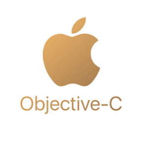

    <h1 align="center">✩&emsp;Oliver Nguyen&emsp;✩</h1>

    

🪪 I’m studying master Computer Science and living at Fairfield, Iowa, USA 🇺🇸.  
🏠 I’m from Ho Chi Minh City, Vietnam 🇻🇳.  
💌 I’m stamp collector and coin collector 🪙 
⚽️ I'm loving and playing soccer

 

**Languages**

<code></code>
<code></code>
<code></code>
<code></code>
<code></code>
<code></code>

**Mobile**

<code></code>
<code></code>
<code></code>

**Web**

<code></code>
<code></code>

**Backend**

<code></code>
<code></code>

**CI/CD**

<code></code>
<code></code>
<code></code>

**Databases**

<code></code>
<code></code>
<code></code>
<code></code>

**Tools**

<code></code>
<code></code>
<code></code>
<code></code>

**Others**

<code></code>
<code></code>
<code></code>
<code></code>

 
 
